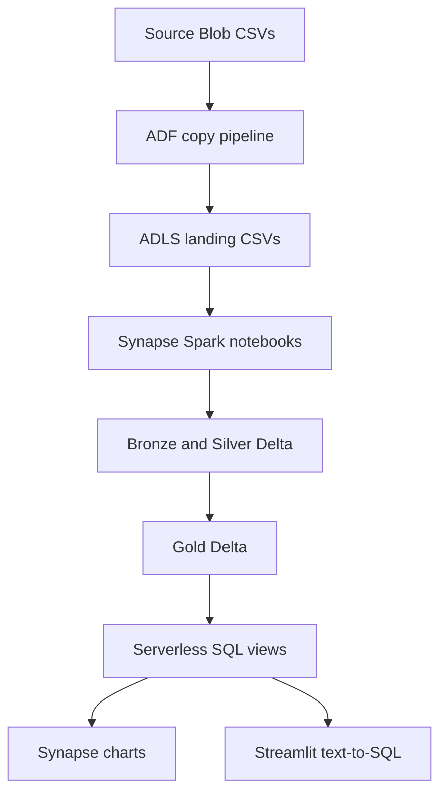

# Azure food delivery analytics

An Azure batch data engineering capstone using synthetic food delivery data. ADF ingests six CSVs; Synapse Spark builds and checks Bronze, Silver, and Gold Delta tables; Synapse serverless SQL exposes Gold views to charts and a local text-to-SQL Streamlit app.

## Architecture

The three layers are folders in the `landing` container of `stfooddeliverylake`; serverless SQL views reference Gold folders without copying their data. The `food_delivery_analytics` SQL database contains the existing `dbo.city_food_demand`, `dbo.city_cuisine_pricing`, and `dbo.restaurant_performance` views. View definitions are not included in the ADF export; preserve/export them separately before recreating the environment.

## What is here

| Path | Purpose |
| --- | --- |
| `adf/` | Current published ADF ARM export (two pipelines, datasets, linked services) |
| `synapse/notebooks/` | Four Spark notebooks and readable Python counterparts |
| `app/` | Local Streamlit question → SQL → table and natural-language answer |
| `sql/` | Smoke queries for the three existing views |
| `scripts/validate_repo.py` | Offline structural checks used by GitHub Actions |
| `.github/workflows/ci.yml` | Validate code and ADF dependencies on pull requests and pushes |
| `.github/workflows/deploy.yml` | Manually invoked Azure deployment, requiring OIDC and environment approval |

## Source data and contract

Six synthetic input files: `food.csv`, `restaurant.csv`, `users.csv`, `menu.csv`, `order_items.csv`, `reviews.csv`. Upload to the configured source Blob container (not committed to Git). ADF `pl_ingest_all_files` iterates over the `files` array, calling `pl_ingest_food`. Names and columns are checked by `nb_01_bronze_silver` before any Bronze overwrite. The default `files` list is an input contract; changing a filename requires updating the corresponding ADF copy destination and notebook mapping.

The current pipeline is a **full refresh**. It overwrites stable Delta paths. Run one pipeline instance at a time; don't set a recurring schedule while using the same static files. ADF presently does not automatically start on a Blob upload.

## Pipeline run

| Order | Activity | What it does |
| --- | --- | --- |
| 1 | `ForEach1` | Copy the six CSVs into ADLS |
| 2 | `TransformFoodDelivery` | `nb_01_bronze_silver`: Bronze and Silver Delta |
| 3 | `ValidateFoodDelivery` | `nb_02_validate_silver`: Silver checks |
| 4 | `BuildGold` | `nb_03_build_gold`: three Gold tables |
| 5 | `ValidateGold` | `nb_04_validate_gold`: Gold checks |

Each notebook's first code cell is `ROOT = ""` and must be marked **parameter cell** in Synapse. ADF supplies `ROOT=abfss://landing@stfooddeliverylake.dfs.core.windows.net`. All four ADF activities use the `sparkfooddev` pool. A successful Oct 3, 2026 debug run completed all activities; the three SQL views and local chatbot returned rows.

## Run the app locally

See [`app/README.md`](app/README.md). It uses Azure CLI sign-in and a local `.env` for the Synapse SQL endpoint, tenant, and OpenAI key. Never commit `.env`, access tokens, raw data, or query logs.

## CI/CD and deployment

CI checks JSON structure, notebook parameter cells, Python syntax, and ADF activity dependencies without using Azure resources. The manual deploy workflow uses GitHub OIDC (no stored Azure client secret), updates the four notebooks, then deploys ADF ARM resources. Azure resources such as the storage account, Synapse workspace, Spark pool, firewall, managed identity permissions, and SQL views must already exist. See [`docs/deployment.md`](docs/deployment.md) before enabling it. No deployment has been run from GitHub Actions yet.

## Monitoring and next improvements

ADF Monitor exposes activity status and error logs; failing Silver or Gold checks fail the pipeline. Next: export/version the SQL view definitions, configure failure alerting, add a manifest and incremental ingestion for new batches, stage Gold before promotion, add a catalog and lineage, and add an optional Airflow learning track. These are planned work, not deployed features.

## Attribution

Inspired by [Darshil Parmar's Zomato project](https://github.com/darshilparmar/zomato-ai-data-engineering-end-to-end-project). This is an independently implemented Azure/Synapse adaptation; no source data or project code is copied from that repository.
